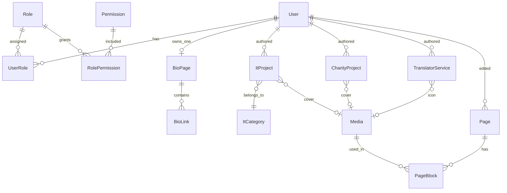

# GrasiApp — Skema Database

> **Status:** Keputusan dikonfirmasi (siap implementasi Prisma)  
> **Terakhir diperbarui:** 25 Mei 2026  
> **ORM:** Prisma + PostgreSQL  
> **Acuan:** [ARSITEKTUR.md](./ARSITEKTUR.md)

---

## 1. Ringkasan domain

```text
┌─────────────────────────────────────────────────────────────┐
│  A. Company site (landing)     → konten perusahaan, ID/EN   │
│     • ItProject        — portofolio / proyek IT             │
│     • CharityProject   — program / konten charity           │
│     • TranslatorService — halaman layanan penerjemahan    │
├─────────────────────────────────────────────────────────────┤
│  B. Admin & akses              → User, Role, Permission     │
├─────────────────────────────────────────────────────────────┤
│  C. Bio / Link page            → max 1 per user, /u/[slug] │
│     • Akses hanya jika permission dibuka admin              │
└─────────────────────────────────────────────────────────────┘
```

**Keputusan desain:** IT, Charity, dan Translator **dipisah** (tiga tabel/domain berbeda), bukan satu tabel `Project` + `type`.

---

## 2. Diagram relasi (ER)



---

## 3. Konten terpisah: IT, Charity, Translator

### 3.1 Tiga tabel independen

| Tabel | Peran di situs | URL public (contoh) |
|-------|----------------|---------------------|
| `ItProject` | Portofolio proyek IT | `/id/it`, `/id/it/[slug]` |
| `CharityProject` | Program / kampanye charity | `/id/charity`, `/id/charity/[slug]` |
| `TranslatorService` | **Layanan** penerjemahan (bukan portofolio) | `/id/translator`, `/id/translator/[slug]` |

`slug` **unik per tabel** (boleh sama antar tabel, mis. `intro` di IT dan Charity — URL path tetap beda).

Halaman **overview** tiap divisi (`/id/translator` intro + daftar layanan) bisa dari:
- `Page` CMS (`slug = translator-overview`), atau
- field intro di `SiteSettings` / section khusus — implementasi fleksibel di fase 2.

### 3.2 `ItProject`

| Field | Tipe | Keterangan |
|-------|------|------------|
| id | UUID | PK |
| slug | String | unique |
| titleId, titleEn | String | |
| summaryId, summaryEn | Text | kartu listing |
| bodyId, bodyEn | Text | detail |
| coverMediaId | FK → Media | nullable |
| clientName | String | nullable |
| techStack | String[] / JSON | nullable |
| demoUrl, repoUrl | String | nullable |
| year | Int | nullable |
| categoryId | FK → ItCategory | **wajib** — lihat §3.5 |
| status | DRAFT \| PUBLISHED \| ARCHIVED | |
| featured | Boolean | |
| sortOrder | Int | |
| publishedAt | DateTime | nullable |
| createdById | FK → User | |
| createdAt, updatedAt | DateTime | |

### 3.3 `CharityProject`

| Field | Tipe | Keterangan |
|-------|------|------------|
| id | UUID | PK |
| slug | String | unique |
| titleId, titleEn | String | |
| summaryId, summaryEn | Text | |
| bodyId, bodyEn | Text | |
| coverMediaId | FK → Media | nullable |
| beneficiary | String | nullable |
| location | String | nullable |
| donationUrl | String | nullable |
| goalAmount, raisedAmount | Decimal | nullable |
| periodStart, periodEnd | Date | nullable |
| status, featured, sortOrder, publishedAt | | sama pola IT |
| createdById | FK → User | |
| createdAt, updatedAt | DateTime | |

### 3.4 `TranslatorService` (layanan)

| Field | Tipe | Keterangan |
|-------|------|------------|
| id | UUID | PK |
| slug | String | unique |
| nameId, nameEn | String | nama layanan |
| descriptionId, descriptionEn | Text | |
| iconMediaId | FK → Media | nullable |
| sourceLanguages | String[] | contoh: `["id","en"]` |
| targetLanguages | String[] | |
| serviceType | enum / string | document, interpreting, localization, … |
| pricingNoteId, pricingNoteEn | Text | catatan harga / “hubungi kami” |
| sampleUrl | String | nullable — contoh hasil |
| status, featured, sortOrder, publishedAt | | |
| createdById | FK → User | |
| createdAt, updatedAt | DateTime | |

**Public:** `/id/translator` menampilkan intro + grid `TranslatorService` yang `PUBLISHED`.

### 3.5 Kategori IT (`ItCategory`) — MVP

**Keputusan:** modul IT **memakai kategori** untuk filter dan pengelompokan di halaman public.

| Sub-kategori (contoh seed) | Contoh proyek |
|--------------------------|----------------|
| `web` | Website company profile |
| `mobile` | Aplikasi Android/iOS |
| `ai` | Chatbot, analitik |
| `infrastructure` | DevOps, cloud migration |

**Tabel `ItCategory`:**

| Field | Keterangan |
|-------|------------|
| id | UUID |
| slug | unique — `web`, `mobile`, … |
| nameId, nameEn | label tampilan |
| descriptionId, descriptionEn | Text — nullable, untuk halaman kategori |
| sortOrder | urutan tab/filter |
| isActive | Boolean — sembunyikan tanpa hapus |

**Relasi:** `ItProject.categoryId` → `ItCategory` (**required**, tidak nullable).

**Public `/id/it`:**

- Tab/filter: **Semua** + tiap kategori aktif
- `/id/it?category=web` atau `/id/it/category/web` (pilih satu pola saat implementasi)
- Setiap kartu proyek menampilkan badge kategori

**Admin:**

- CRUD `ItCategory` (super_admin / admin)
- Saat buat/edit `ItProject`, **wajib pilih kategori** (dropdown)

---

## 4. User & Role

### 4.1 `User`

| Field | Keterangan |
|-------|------------|
| email | unique |
| passwordHash | |
| name | |
| avatarMediaId | nullable |
| isActive | |
| canAccessBio | Boolean | **opsional shortcut** — atau murni lewat permission saja |

Disarankan: akses bio lewat **permission** `bio_page.access` (admin centang / assign role), bukan semua user otomatis.

### 4.2 Role & Permission

| Permission (contoh) | Arti |
|---------------------|------|
| `it_category.*` | CRUD ItCategory |
| `it_project.*` | CRUD ItProject |
| `charity_project.*` | CRUD CharityProject |
| `translator_service.*` | CRUD TranslatorService |
| `bio_page.access` | Boleh punya & edit bio sendiri |
| `bio_page.manage` | Admin lihat/edit semua bio |
| `user.manage` | Kelola user & role |

| Role (contoh) | Akses |
|---------------|--------|
| `super_admin` | Semua |
| `admin` | Konten + user (tanpa ubah super) |
| `editor` | CRUD IT / Charity / Translator + Page |
| `bio_user` | `bio_page.access` + bio sendiri saja |

---

## 5. Bio page (Linktree) — keputusan final

| Aturan | Nilai |
|--------|--------|
| Halaman per user | **1 saja** — `BioPage.userId` **UNIQUE** |
| Siapa boleh buat | User yang punya permission **`bio_page.access`** (dibuka admin) |
| URL | `https://domain.com/u/[slug]` |
| Background | **COLOR \| GRADIENT \| IMAGE** saja (tanpa video) |

### 5.1 `BioPage`

| Field | Keterangan |
|-------|------------|
| userId | FK → User, **@unique** |
| slug | unique global |
| displayName, bio | |
| avatarMediaId, backgroundMediaId | |
| backgroundType | COLOR \| GRADIENT \| IMAGE |
| backgroundValue | hex / CSS gradient |
| themePreset, buttonStyle, buttonColor, textColor | |
| status, publishedAt | |

### 5.2 `BioLink`

Sama seperti draft sebelumnya: `bioPageId`, `title`, `url`, `sortOrder`, `isActive`, `openInNewTab`.

**Alur akses:**

1. Admin buat user + assign role/permission `bio_page.access`
2. User login → editor bio (satu halaman) → publish
3. Public: `/u/{slug}`

---

## 6. Entitas pendukung

- `Page` — CMS (about, contact, translator overview, …)
- `PageBlock` — section home (opsional)
- `Media` — upload terpusat
- `SiteSettings` — logo, WA, email, sosial
- `ContactMessage` — inbox form

---

## 7. Indeks & constraint

```text
User.email                         UNIQUE
ItCategory.slug                    UNIQUE
ItProject.slug                     UNIQUE
ItProject.categoryId             INDEX
CharityProject.slug                UNIQUE
TranslatorService.slug             UNIQUE
BioPage.slug                       UNIQUE
BioPage.userId                     UNIQUE   ← 1 bio per user
UserRole (userId, roleId)          UNIQUE
```

---

## 8. Draft Prisma (terpisah)

```prisma
enum PublishStatus { DRAFT PUBLISHED ARCHIVED }
enum BackgroundType { COLOR GRADIENT IMAGE }

model ItProject {
  id          String   @id @default(uuid())
  slug        String   @unique
  titleId     String
  titleEn     String
  summaryId   String?
  summaryEn   String?
  bodyId      String?  @db.Text
  bodyEn      String?  @db.Text
  clientName  String?
  techStack   Json?
  demoUrl     String?
  repoUrl     String?
  year        Int?
  categoryId  String
  category    ItCategory @relation(fields: [categoryId], references: [id])
  status      PublishStatus @default(DRAFT)
  featured    Boolean  @default(false)
  sortOrder   Int      @default(0)
  publishedAt DateTime?
  createdById String
  createdBy   User     @relation(fields: [createdById], references: [id])
  @@index([status, featured])
}

model CharityProject {
  id            String   @id @default(uuid())
  slug          String   @unique
  titleId       String
  titleEn       String
  summaryId     String?
  summaryEn     String?
  bodyId        String?  @db.Text
  bodyEn        String?  @db.Text
  beneficiary   String?
  location      String?
  donationUrl   String?
  goalAmount    Decimal? @db.Decimal(12, 2)
  raisedAmount  Decimal? @db.Decimal(12, 2)
  periodStart   DateTime?
  periodEnd     DateTime?
  status        PublishStatus @default(DRAFT)
  featured      Boolean  @default(false)
  sortOrder     Int      @default(0)
  publishedAt   DateTime?
  createdById   String
  createdBy     User     @relation(fields: [createdById], references: [id])
}

model TranslatorService {
  id               String   @id @default(uuid())
  slug             String   @unique
  nameId           String
  nameEn           String
  descriptionId    String?  @db.Text
  descriptionEn    String?  @db.Text
  sourceLanguages  String[]
  targetLanguages  String[]
  serviceType      String
  pricingNoteId    String?
  pricingNoteEn    String?
  sampleUrl        String?
  status           PublishStatus @default(DRAFT)
  featured         Boolean  @default(false)
  sortOrder        Int      @default(0)
  publishedAt      DateTime?
  createdById      String
  createdBy        User     @relation(fields: [createdById], references: [id])
}

model BioPage {
  id                String   @id @default(uuid())
  userId            String   @unique  // 1 halaman per user
  user              User     @relation(fields: [userId], references: [id])
  slug              String   @unique
  displayName       String
  bio               String?
  backgroundType    BackgroundType @default(COLOR)
  backgroundValue   String?
  status            PublishStatus @default(DRAFT)
  links             BioLink[]
}

model ItCategory {
  id             String      @id @default(uuid())
  slug           String      @unique
  nameId         String
  nameEn         String
  descriptionId  String?
  descriptionEn  String?
  sortOrder      Int         @default(0)
  isActive       Boolean     @default(true)
  projects       ItProject[]
  @@index([isActive, sortOrder])
}
```

---

## 9. Routing vs tabel

| URL | Tabel |
|-----|--------|
| `/id/it` | `ItProject` list + filter `ItCategory` |
| `/id/it/category/[slug]` | `ItProject` per kategori (opsional, alternatif query) |
| `/id/it/[slug]` | `ItProject` |
| `/id/charity` | `CharityProject` list |
| `/id/charity/[slug]` | `CharityProject` |
| `/id/translator` | `Page` overview + `TranslatorService` list |
| `/id/translator/[slug]` | `TranslatorService` |
| `/u/[slug]` | `BioPage` + `BioLink` |
| `/admin/it-categories` | `ItCategory` |
| `/admin/it-projects` | `ItProject` |
| `/admin/charity` | `CharityProject` |
| `/admin/translator` | `TranslatorService` |
| `/admin/bio` | `BioPage` (filter by permission) |

---

## 10. Keputusan konfirmasi (arsip)

| # | Pertanyaan | Jawaban |
|---|------------|---------|
| Struktur konten | Satu tabel vs pisah? | **Dipisah** — `ItProject`, `CharityProject`, `TranslatorService` |
| 1 | Translator | **Halaman layanan** (`TranslatorService`) |
| 2 | Bio per user | **1 halaman** (`userId` unique) |
| 3 | Siapa buat bio | Hanya user yang **diberi akses** (`bio_page.access`) |
| 4 | URL bio | `/u/[slug]` ✅ |
| 5 | Background | Warna / gradient / gambar ✅ |
| 6 | Sub-kategori IT | **Ya** — `ItCategory` + `categoryId` wajib (§3.5) |

---

## 11. Fase implementasi

| Fase | Tabel |
|------|--------|
| M1 | User, Role, Permission, Media |
| M2 | ItCategory, ItProject, CharityProject, TranslatorService, Page, SiteSettings, ContactMessage |
| M3 | BioPage, BioLink |
| M4 | PageBlock, analytics |

---

## 12. Changelog

| Tanggal | Perubahan |
|---------|-----------|
| 2026-05-25 | Draft awal (satu tabel Project) |
| 2026-05-25 | **Final:** tabel terpisah; Translator = layanan; bio 1/user; keputusan §10 |
| 2026-05-25 | **ItCategory** masuk MVP — kategori wajib per ItProject |

---

*Diimplementasikan di `prisma/schema.prisma` — jalankan `npm run db:migrate` dan `npm run db:seed`.*
